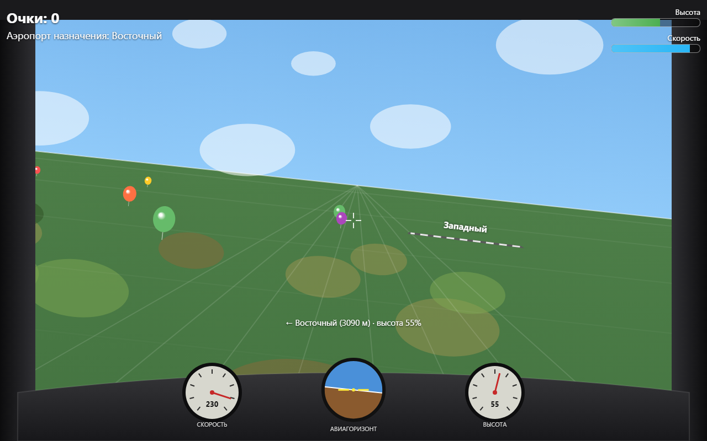

# Aeropilot

*[Читать на русском](README_RU.md)*

A small arcade flight-sim game in the browser: first-person cockpit view, flying between airports, landing, and shooting down balloons.

## How to run

Open [index.html](index.html) in a browser — no build step, no server required.

## Controls

- **← →** — turn the aircraft (smooth, with visual bank)
- **↑ ↓** — climb / descend
- **Ctrl** (hold) — fire a twin-gun at the crosshair in the center of the screen
- Mouse is not used — keyboard only

## Gameplay

- The cockpit has an instrument panel: airspeed gauge, artificial horizon (mirrors bank and pitch), and altimeter.
- A compass hint at the bottom of the screen shows the direction and distance to the current target airport.
- Fly to the highlighted airport, descend to near-zero altitude exactly over the runway, and align your heading with it — a successful landing scores +50 points and a new target is assigned.
- If altitude reaches zero anywhere off the runway, it's a crash and the game restarts.
- Shoot down balloons along the way (+10 points each), with gunfire sound effects.
- The terrain beneath the aircraft smoothly shifts in color and texture across different regions of the map (meadows, forest, fields, wetlands).

## Tech stack

A single HTML file: Canvas 2D, vanilla JavaScript (no frameworks, no build step), sound via the Web Audio API.
