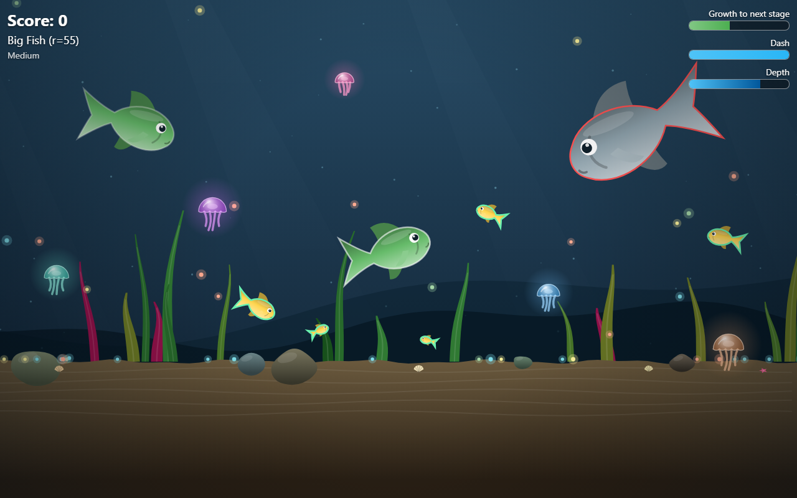

#  Рыбий Пир

*[Read in English](README.md)*

Небольшая аркада в браузере: ты — маленькая рыбка в открытом море. Ешь планктон и рыб мельче себя, расти и поднимайся по пищевой цепи — от малька до Морского Царя. Берегись тех, кто крупнее тебя.

## Как запустить

Открой [index.html](index.html) в браузере — сборка и сервер не нужны.

## Управление

- **← →** — поворот
- **Ctrl** (или **↑**) — рывок (буст), тратит выносливость, которая восстанавливается со временем — вдвое быстрее, пока ты растёшь после съеденной рыбы
- **Esc** (или **P**, или кнопка паузы под индикаторами вверху справа) — пауза: продолжить, начать заново или сменить сложность
- Мышь не используется — только клавиатура

**На телефоне/планшете:** при старте игра переходит в полноэкранный режим (если браузер это поддерживает; на iPhone добавь страницу на экран «Домой» для полноэкранного вида). Води пальцем в **левой половине** экрана как джойстиком — рыба поворачивает туда, куда ты тянешь. Касание и удержание в любом месте **правой половины** экрана — рывок. Можно делать и то, и другое одновременно.

## Сложность

Сложность выбирается на стартовом экране (Space/Enter — Medium):

- **Easy** — корма вдвое больше, остальные рыбы плавают на 10% медленнее, запас рывка на 50% больше и восстанавливается на 50% быстрее. Рыбы убегают и догоняют неточно — отклоняясь до 20° от идеального направления — и реагируют примерно за 0,3 с.
- **Medium** — на 50% больше корма, остальные рыбы плавают на 5% медленнее, запас рывка на 25% больше и восстанавливается на 25% быстрее. Рыбы отклоняются до 10° и реагируют примерно за 0,25 с.
- **Hard** — обычная игра. Рыбы отклоняются до 5° и реагируют примерно за 0,2 с.

На любом уровне рыбы замечают тебя с задержкой, близкой к человеческой, и поворачивают плавно, без рывков к цели.

## Графика

На стартовом экране есть переключатель **Graphics** (выбор запоминается):

- **High** — полное качество: солнечные лучи, виньетка и светящийся планктон, разрешение до 2560×1440.
- **Low** — для слабых ноутбуков и телефонов: без лучей, виньетки и свечения планктона, разрешение до 1600×900 с растягиванием на экран.

## Демо

Кнопка **Demo** под переключателем графики запускает игру на лёгком уровне, где рыба плывёт сама: в отличие от других рыб она реагирует мгновенно и целится точно, видит дальше и играет умнее: убегает сразу от всех подплывших хищников (сильнее всего от тех, кто смотрит на неё), а на далёких не отвлекается, гонится за самой выгодной добычей, если рядом с ней нет хищника, и целится туда, куда та плывёт, не охотится за планктоном (ест только тот, на который наткнётся), пока малёк — держится подальше от поверхности с чайками, обходит медуз, а после пары прыжков из воды на время уходит на глубину. Рывок — чтобы убежать или догнать добычу; полный запас тратит на охоту, но всегда оставляет резерв для побега. После гибели демо начинается заново; любая клавиша или касание экрана возвращают в меню. Демо-забеги не попадают в рекорды.

## Игровой процесс

- Море бесконечно влево и вправо. Внизу — **дно**, наверху — **поверхность**, а на горизонте тропический остров, облака и чайки. Глубина такая, что подъём со дна до поверхности на полном рывке занимает около 18 секунд у малька и около 13 секунд у самой крупной рыбы.
- **Прыжки.** Рвани вверх к поверхности — и рыба выпрыгнет из воды: она летит по настоящей баллистической дуге (в воздухе управлять нельзя) и падает обратно с брызгами — всплеск, капли, пена и пузыри. Чем круче и быстрее выход, тем выше прыжок; крупным рыбам для прыжка нужен рывок, иначе они просто скользят у поверхности, выставив спину из воды. Другие рыбы у поверхности тоже выпрыгивают — иногда просто так, иногда в погоне за добычей или спасаясь от хищника; их всплески звучат тем тише, чем они дальше, и тем громче, чем крупнее рыба. Над водой на разной высоте летают чайки… кто знает, на что способен хороший прыжок. Только мальку стоит быть осторожнее: для чайки он сам закуска — схватит и улетит.
- Глубина имеет значение. У дна вода тёмная, корма много, а рыбы — самые мелкие: спокойное место, чтобы пастись. Чем выше поднимаешься к поверхности, тем светлее вода и тем крупнее (и опаснее) соперники. Следи за шкалой «Глубина», чтобы понимать, где ты находишься.
- Каждая рыба на экране обведена цветом: **зелёный** — её можно съесть, **красный** — она съест тебя, бледно-белый — вы примерно одного размера и просто разминётесь без последствий.
- Хищников, которых ещё не видно, показывает **радар опасности**: пульсирующее красное свечение у края экрана с их стороны и стрелка в их направлении. Чем крупнее и ближе рыба, тем свечение больше, ярче и тем чаще пульсирует; двойная стрелка — рыба плывёт прямо к тебе. Когда рыба появляется на экране, свечение гаснет.
- Есть можно только **ртом** — голова перед жабрами должна дотянуться до рыбы или хотя бы до свечения вокруг корма. С хищниками так же: если ты прямо за хвостом большой рыбы, она не съест тебя, пока не развернётся.
- Планктон всегда немного увеличивает тебя. Рыба поменьше даёт куда больший рост. Рост после каждой еды идёт плавно в течение 3 секунд.
- Чтобы съесть рыбу (или быть съеденным), нужно быть заметно крупнее — при почти равном размере ничего не происходит, так что обидных случайностей не будет.
- Сразу после старта ты ненадолго неуязвим (голубое свечение) — есть время оглядеться, прежде чем хищники начнут охоту.
- Медузы не смертельны, но при касании жалят: ты немного уменьшаешься и замедляешься — их стоит обходить. Другие рыбы тоже получают ожоги и стараются обплывать медуз. Акулам и тем, кто крупнее, медузы не страшны: они их не жалят, а сами становятся едой — и для тебя тоже, как только ты станешь акулой.
- Чем ты крупнее, тем сильнее камера отдаляется, а море вокруг заселяется рыбами размера, соразмерного тебе — всегда есть, кого съесть, и кого бояться.
- Дойди до финальной стадии (Морской Царь), чтобы стать вершиной пищевой цепи. Появится поздравление с затраченным временем и лучшим временем для выбранной сложности (а если это новый рекорд — отдельное поздравление). Дальше можно продолжить игру и расти дальше или начать заново.
- На экране показаны твой вес и длина: малёк начинает с 5 см и примерно 1 г (вес растёт как куб длины), и с каждым шагом роста они умножаются — вплоть до 29 м и 200 т, как у самого большого синего кита. Это максимальный размер в игре (крупнее рыб не бывает). При его достижении запускается салют и показывается твоё время и рекорд для этой сложности; можно продолжить (расти ты больше не будешь) или начать заново.
- Чем ты крупнее, тем меньше вокруг других рыб и тем реже они встречаются — море не превращается в толкучку гигантов. Большинство встречных рыб близки к тебе по размеру — у дна чаще мельче, у поверхности чаще крупнее, — иногда попадается и мелюзга. Настоящие гиганты при этом редкость: чем крупнее была бы рыба, тем реже она появляется, так что Морской Царь встречает в основном акул и царей помельче, которых можно съесть, и лишь изредка — соперника своего размера.
- Остальные рыбы живут по тем же правилам: крупные едят мелких, если поймают ртом, а наткнувшись на корм, съедают его и растут (специально за кормом они не плавают).
- Если тебя съедят — игра окончена, в следующий раз попробуй вырасти побольше.

## Технологии

HTML + CSS + несколько файлов на чистом JavaScript (`utils.js`, `audio.js`, `input.js`, `scenery.js`, `fireworks.js`, `constants.js`, `game.js`) — без фреймворков и сборки. Canvas 2D для графики, Web Audio API для звука.
