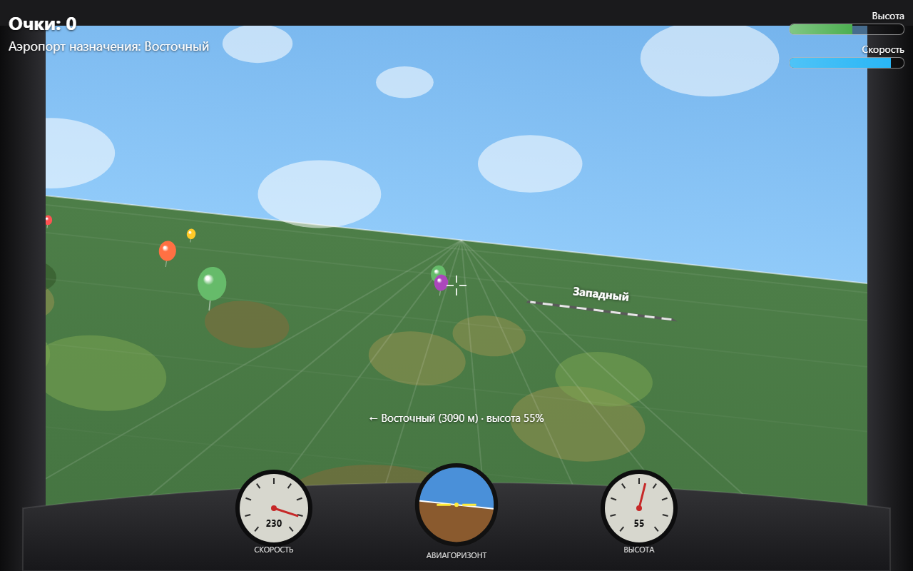
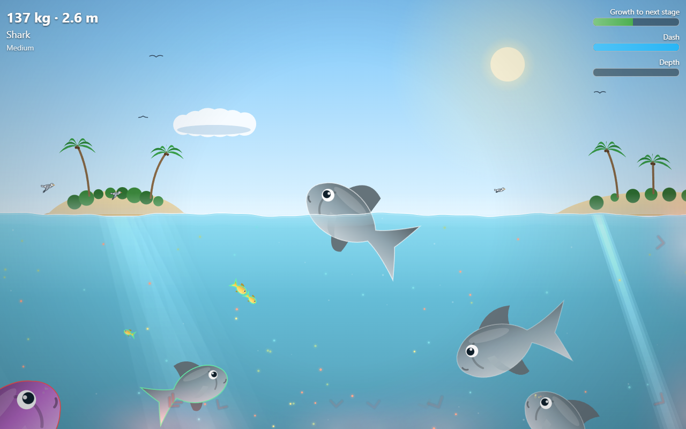
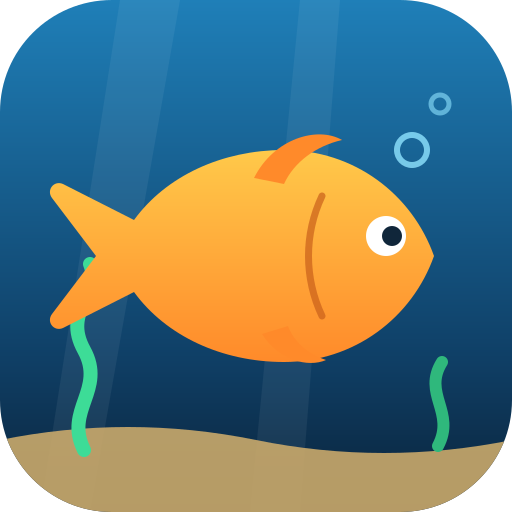
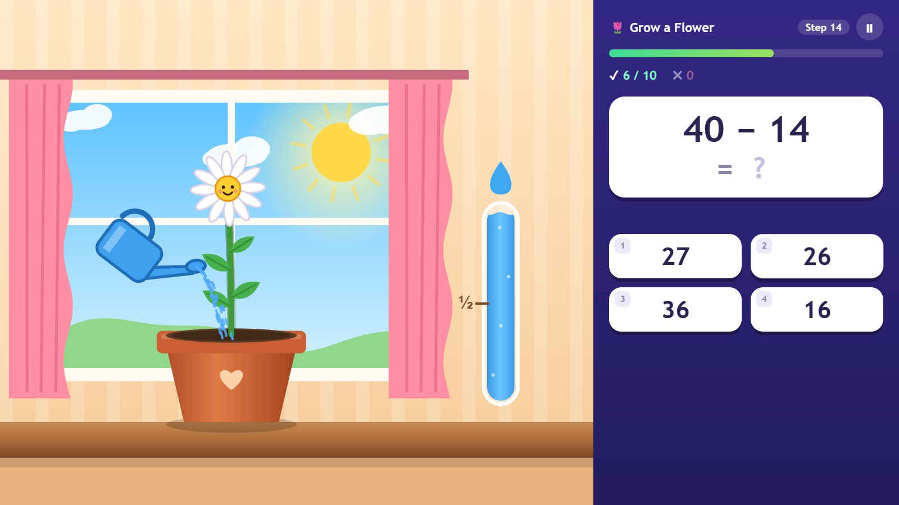
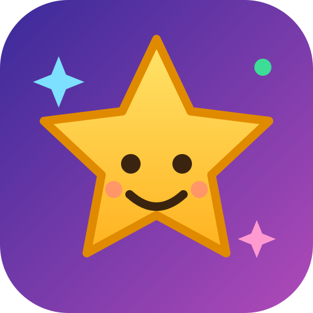
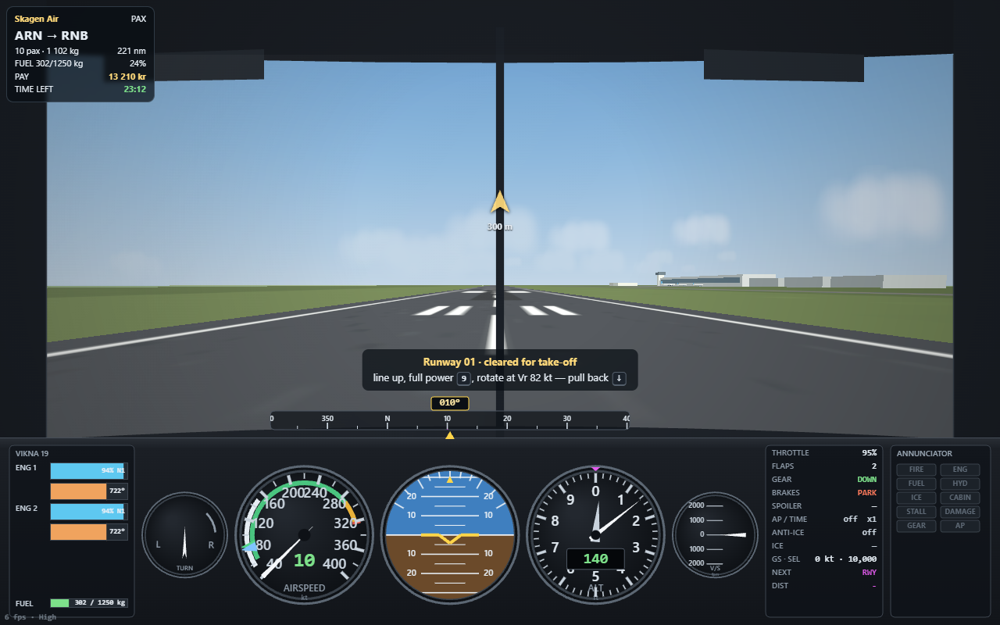

<div align="center">


# Browser Games Gallery

**Tiny self-contained browser games in vanilla JavaScript. No install — just open and play.**

[](https://gray0072.github.io/ivan/)


[](LICENSE)

*[Читать на русском](README_RU.md)* · *[Läs på svenska](README_SV.md)*

</div>

---

## 🎮 Games

<table>
  <tr>
    <td width="50%" valign="top">
      <a href="https://gray0072.github.io/ivan/flight-simulator/"></a>
      <h3> Flight Simulator</h3>
      <p>First-person arcade flight game: steer with the arrow keys, fire a twin-gun with Ctrl to pop balloons for points, and land on the highlighted airport's runway.</p>
      <p><a href="https://gray0072.github.io/ivan/flight-simulator/"><b>▶ Play</b></a> · <a href="flight-simulator/">Source</a></p>
    </td>
    <td width="50%" valign="top">
      <a href="https://gray0072.github.io/ivan/fish-frenzy/"></a>
      <h3> Fish Frenzy</h3>
      <p>Eat-and-grow arcade game: steer a fish with the arrow keys or a touch joystick, eat plankton and smaller fish with your mouth, avoid bigger ones and jellyfish, and climb the food chain to the Sea King and the maximum size. Three difficulty levels and best-time records.</p>
      <p><a href="https://gray0072.github.io/ivan/fish-frenzy/"><b>▶ Play</b></a> · <a href="fish-frenzy/">Source</a></p>
    </td>
  </tr>
  <tr>
    <td width="50%" valign="top">
      <a href="https://gray0072.github.io/ivan/fun-training/"></a>
      <h3> Fun Training</h3>
      <p>A training game for school kids: water a flower, stop zombies, lay rails for a train, keep a balloon in the air, a campfire burning or a panda fed and happy by answering tasks in time. Spend the coins on your own character: feed it, dress it up and furnish its room.</p>
      <p><a href="https://gray0072.github.io/ivan/fun-training/"><b>▶ Play</b></a> · <a href="fun-training/">Source</a></p>
    </td>
    <td width="50%" valign="top">
      <a href="https://gray0072.github.io/ivan/world-aviation/"></a>
      <h3> World Aviation</h3>
      <p>A cockpit-view flight simulator and airline career: start with Swedish domestic flights out of Arlanda, win Scandinavia, then the whole world region by region. Push back, taxi, take off, handle emergencies with the checklists, fly the ILS, land and taxi to the gate.</p>
      <p><a href="https://gray0072.github.io/ivan/world-aviation/"><b>▶ Play</b></a> · <a href="world-aviation/">Source</a></p>
    </td>
  </tr>
</table>

## ✨ Highlights

- **Zero install** — every game runs straight in the browser, on desktop and mobile.
- **Touch controls** — on-screen joysticks, tap-and-hold and device tilt on phones and tablets.
- **Pure web platform** — Canvas 2D for graphics, Web Audio for synthesized sound. No frameworks, no asset pipeline.
- **Self-contained** — each game lives in its own folder and still works when copied out of the repo.

## 🚀 Run locally

```bash
git clone https://github.com/gray0072/ivan.git
cd ivan
npx serve .        # or just open any index.html in a browser
```

## 🌐 Deploy

There is no build step. GitHub Pages serves the `main` branch root directly
(**Settings → Pages → Deploy from a branch → `main` / `(root)`**), so pushing to `main` is the whole deploy.

## 📁 Project structure

```
/
├── index.html                  # root gallery page
├── assets/                     # repo icon and social preview image
├── README.md / README_RU.md / README_SV.md
├── SPEC.md                     # technical spec
├── AGENTS.md                   # instructions for AI coding agents
├── CLAUDE.md                   # -> points to AGENTS.md
├── flight-simulator/
│   ├── SPEC.md                 # spec of this game
│   ├── index.html              # the game
│   ├── README.md / README_RU.md
│   ├── icon.svg
│   └── screenshot.png
├── fish-frenzy/
│   ├── SPEC.md                 # spec of this game
│   ├── index.html              # markup
│   ├── styles.css, *.js        # styles and game code, split by concern
│   ├── README.md / README_RU.md
│   ├── icon.svg
│   └── screenshot.png
├── fun-training/
│   ├── SPEC.md                 # spec of this game
│   ├── index.html, styles.css, *.js
│   ├── README.md / README_RU.md
│   ├── icon.svg
│   └── screenshot.png
├── world-aviation/
│   ├── SPEC.md                 # spec of this game
│   ├── index.html, styles.css, constants.js, game.js, career.js
│   ├── lib/, core/, data/, art/, sim/, render/, ui/
│   ├── README.md / README_RU.md / README_SV.md
│   ├── icon.svg
│   └── screenshot.png
└── ...                         # more games over time, same layout
```

## 🗺️ Roadmap

- [ ] More mini-games and experiments
- [ ] Search/filter on the gallery page
- [ ] Light/dark toggle on the gallery page

## 📄 License

[MIT](LICENSE)
