#  World Aviation

*[Читать на русском](README_RU.md)* · *[Läs på svenska](README_SV.md)*

A cockpit-view flight simulator and airline career in the browser. You are a Swedish commercial pilot with an EASA ATPL, based at **Stockholm Arlanda**. You start with Swedish domestic flights — Gothenburg, Malmö, Visby, Kiruna above the Arctic Circle — then win Scandinavia and the North Atlantic, and region by region the whole world: London and Paris, Dubai and Johannesburg, New York and Mexico City, Tokyo and Sydney. Every flight goes from gate to gate: push back, start the engines, taxi, take off, cope with the weather and with whatever breaks, land, and park at the gate.

**▶ Play: [gray0072.github.io/ivan/world-aviation/](https://gray0072.github.io/ivan/world-aviation/)**

## How to run

Open [index.html](index.html) in a browser — no build step, no server required. The 3D view needs WebGL (three.js is included in the folder).

## A flight

1. **At the gate** press **Enter** — the tug pushes you back onto the apron. Start the engines (**Enter**) and watch N1 and EGT come up.
2. **Taxi**: **Space** releases the parking brake (on a phone: **Park**); a little power (**1**–**3**), steer with **← →**, brake with **B**, and follow the yellow arrow to the holding point. The arrow already points along the next leg as you come up to a turn; miss one and it finds you a new way on, and after landing it shows the first exit you can still make.
3. At the **holding point** set the take-off flaps (**F**) and ask for the clearance (**Enter**). Line up, full power (**9**), pull back (**↓**) at Vr, gear up (**G**).
4. **Autopilot** (**Y**): in NAV mode it flies the route, slows down on the descent (using the speed brake itself when it is high), turns onto the final approach without swinging through the centreline and follows the ILS glideslope down to 200 ft (60 m). **T** speeds up time, **R** slows it down: with the autopilot on up to ×128, flying by hand ×2 above 1 000 ft, ×4 above 3 000, ×8 above 6 000, ×16 above 8 000, ×32 above 9 000 and ×64 above 10 000 ft. Near the destination the time slows down by itself, a step every 3 seconds, back to ×1 5 km (2.7 nm) out.
5. **Approach**: flaps and gear down, land by hand from 200 ft (60 m) at Vref, brake, and slow below 35 kt (65 km/h).
6. **Taxi in** along the arrow, stop in the parking box at your gate and set the parking brake (**Space**). The engines shut down and the debrief shows your grade and the invoice.

Pick the **departure time** on the briefing — day, dusk, night or dawn; dusk and dawn pay 5 % more, night 15 %. At night the stars and the moon are out, the airport is its lights (approach lights, PAPI, blue and green taxiway lights, floodlit aprons and lit terminals), your aeroplane shows its navigation lights, beacon and strobes, and your landing lights light up the runway ahead. Below, the real towns and cities glow orange with white centres, roads string them together and villages dot the land, so Stockholm, the Ruhr or Tokyo are where they should be. The clock runs on, so a long evening flight lands in the dark.

Before a flight you can **practise the landing** for a small fee (a share of the hourly lease): you start on the final at the destination, clean — gear and flaps up — the autopilot holds the glide path for 10 seconds and hands over 3 nm out, then you lower the gear and the flaps, land and brake below 35 kt. A good landing earns a little reputation with the client (A+ the most, C the least; only your best practice on each contract counts); a bad one costs nothing more than the fee. Then try again, go back to the briefing or fly it for real.

Starting **at the gate** and flying the whole ground routine yourself pays a bonus: +6 % of the contract and a little reputation. When you just want to fly, start **at the runway** — at the holding point with the engines running and the take-off clearance already given: set the flaps, line up and go. About 5 minutes less on the ground (and less lease on long flights), but no bonus. The game remembers which start you prefer.

## Controls

- **↑ ↓** or **W S** — pitch (↓ pulls the nose up; **Nose up: ↑ Up** on the title screen or in the pause flips it, for the keys and the touch stick) · **← →** or **A D** — roll, and steering on the ground · **Q E** — rudder
- **Z X** or **− +** — throttle · **1**…**8** — 10 %…80 % · **9** — full power · **0** — idle
- **Enter** — the next step on the ground: push back, engine start, take-off clearance
- **G** gear · **F / V** flaps down / up · **B** brakes (hold) · **Space** parking brake · **/** spoiler · **K** anti-ice
- **Y** autopilot · **N** back to the programme (NAV along the route and the planned altitude, after you changed the heading or the altitude) · **, .** selected altitude · **; '** selected heading (HDG mode)
- **T / R** time faster / slower · **C / Shift+C** next / previous view: cockpit, chase, front looking back, wing, tail fin, landing gear, top down, tower / fly-by (en route it cuts every few seconds between shots: waiting beside the flight path, ahead, far off to the side, behind) · **M** moving map (on a big screen: mini map, big map, off) · **I** instrument lights: dim, medium, bright, then a press hides the instruments for a clear view (the next brings them back dim) · **H** controls card · **Esc** pause (the flight stays in view behind it, dimmed; there you can also look at the flight's card and the aircraft's)

**On a phone or tablet** the game goes fullscreen when you start (where the browser allows it). The **left half** of the screen is a floating joystick — it appears where your thumb lands: drag down to pull the nose up, left and right to roll and to steer on the ground (the nosewheel and the control surfaces are hydraulic: they follow your thumb smoothly, not at once). The **slider on the right edge** is the throttle — its lower half gives fine control of low power for taxiing. The flight strip and the hint text sit on the left; tap either to fold or open it (the strip folds to the route, the fuel and the time left). The buttons come in rows of related ones: **Menu · View · Map · Ice** (anti-ice), **AP · NAV** (back to the programme) **· Time − · Time +**, **Flap − · Flap + · Gear · Spoiler**, **Go** (push back, start, take-off clearance) **· Brake · Park** (the parking brake — release it to taxi). The map closes with a tap anywhere on it. A switch that stays on lights up on its button: the autopilot, NAV and the gear down in green, the spoiler and the parking brake in red. Held upright the buttons run across the top and the four main gauges sit two by two on a taller panel; on its side the climb rate is a number next to the altimeter. On a tablet the messages stay on the left under the hint text, as on a computer. Both thumbs work at the same time, so you can fly and work a checklist together.

The controls work in any keyboard layout (the keys are read by their place on the keyboard).

**Sound**: jet fans whine and roar with the power, propellers beat, the wheels rumble over the slab joints, the brakes hiss, the gear and the flaps whir and clunk, the tyres chirp on touchdown — and a voice calls "V one", "rotate" and the radio heights down to "ten" on landing, in the game's language and in feet or metres, as the units setting says. The **Sound** switch on the title screen and in the pause turns all of it off — the callouts and the cabin announcements too.

## Instruments

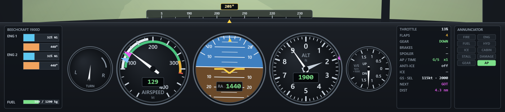

The panel on a computer screen, 4 nm out on the approach to Gothenburg with the gear and the flaps down and the autopilot on the glideslope. From the left: the engines, the turn coordinator, the airspeed, the attitude indicator, the altimeter, the vertical speed and the configuration block with the caution lights, with the heading strip above them. The panel stays on screen in every camera view. On a phone the four main gauges are bigger (held upright they sit two by two) and the configuration block keeps only the flaps, the gear, the autopilot and the ice (the rest is lit on the buttons); held on its side, the climb rate is a number next to the altimeter.

| Instrument | What it shows and how it helps |
|---|---|
| 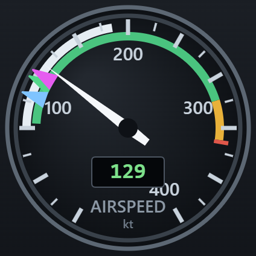 | **Airspeed** — the speed through the air in knots (km/h in metric), on the needle and in the window. Over the centre, **TAS** — the true airspeed: high up the air is thin and the needle reads far below the speed you really fly (a 737 cruising at 453 kt TAS shows about 250 kt); the autopilot holds the needle's speed. **Green arc**: the normal speeds with the flaps up. **White arc**: the flap range — it starts at the stall speed with the landing flaps, and the flaps may be lowered below its upper end. **Amber**: close to the limit, smooth air only. **Red line**: never exceed (Vne). The bugs on the rim: **blue** is Vr, where you pull back on the take-off roll; **green** is Vref, the speed to fly on the final; **magenta** is the speed the autopilot is holding. On the approach keep the needle on the green bug — faster and you float down the runway, slower and you sink or stall. |
| 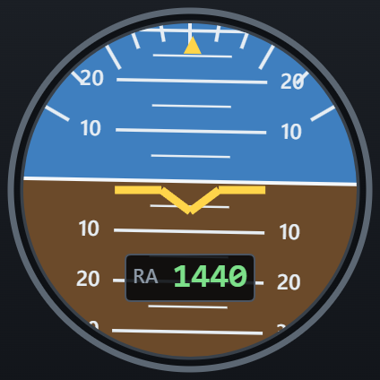 | **Attitude indicator** — where the nose and the wings are against the horizon: blue sky, brown ground, the yellow aeroplane symbol fixed in the middle. The lines are 5° of pitch apart; the scale at the top shows the bank (10°, 20°, 30°, 45°, 60°) with the yellow roll pointer. In cloud, in fog and at night it is the only way to know which way is up: about 10–15° nose up in the climb, near level on the final, 25° of bank in a turn (as the autopilot does). **RA** — the radio altitude, the height of the wheels above the ground (or the water) right below you. It appears below 2 500 ft above the ground, counts down to 0 at the touchdown and turns **amber below 200 ft** on the way down to land, with the "minimums" callout: from here you land by hand. Use it, not the altimeter, to time the flare — start raising the nose gently at about 30 ft. |
| 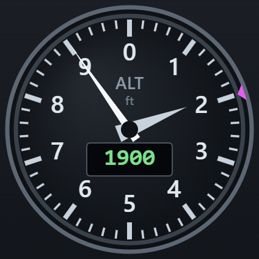 | **Altimeter** — the height above the sea, like a real one: the long needle shows hundreds of feet, the short one thousands, and the window the number (metric: one turn of the long needle is 1 000 m). The **magenta bug** on the rim is the altitude selected for the autopilot (**,** and **.**), on the short needle's scale — the short needle reaches it when you get there. It tells you your cruising level and how high you are over the hills and the sea. On the runway it shows the airport's own height, not zero: Mexico City sits 7 300 ft (2 230 m) above the sea, so for the landing look at the RA. |
| 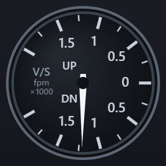 | **Vertical speed (V/S)** — how fast you climb or descend, in thousands of feet a minute (m/s in metric): zero on the right, climbs above it, descents below, up to 2 000 fpm (10 m/s). On a 3° glide path the descent is about five times the ground speed: 130 kt → about 650 fpm. Check it just before the touchdown — more than 600 fpm (3 m/s) is a hard landing, 1 000 fpm (5 m/s) breaks the gear. |
| 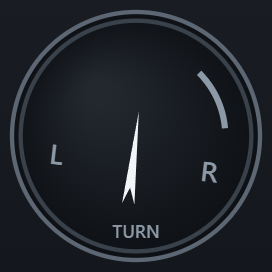 | **Turn coordinator** — the little aeroplane leans as far as the heading is changing: upright, you fly straight; the more it leans, the faster you turn. On the final keep it upright, so that you do not slowly drift off the centreline. |
| 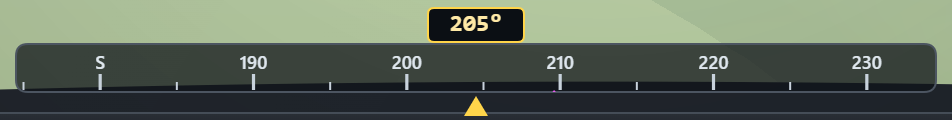 | **Heading strip** — the compass over the panel: the yellow triangle and the box are your heading. The **magenta triangle** under the strip is the bearing to the next point of the route (the runway on the approach) — turn until it sits under the yellow one and you are flying straight at it. In HDG mode a **blue mark** on top is the heading the autopilot is turning to (**;** and **'**). |
| 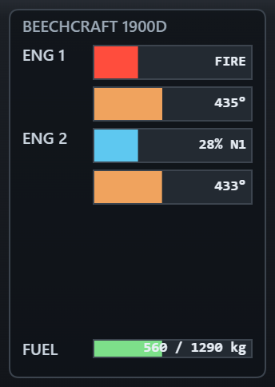 | **Engines** — two bars per engine: **N1** (the fan speed in %, that is the thrust; idle is about 22 %) and **EGT** (the exhaust temperature). During the start watch N1 and EGT come up; in flight the bar says **FIRE**, **FAIL** or **START** at once, so you know which engine has the problem. At the bottom: the **fuel** left, in kg out of the full tanks. |
| 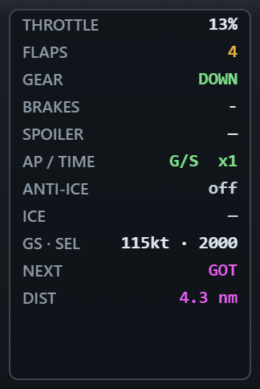 | **Configuration** — the state of everything you set, in words: **THROTTLE** in %, **FLAPS** (amber at the landing settings, "1>3" while they move), **GEAR** (green DOWN, amber while it travels), **BRAKES** (PARK — the parking brake is set), **SPOILER** (red OUT), **AP / TIME** (the autopilot mode — NAV along the route, HDG on a heading, G/S on the glideslope — and the time acceleration), **ANTI-ICE**, **ICE** on the wings in %. Under them four caution lights for what no other instrument shows: **FUEL** (a leak or low fuel), **HYD** (hydraulics), **CABIN** (pressure) and **DAMAGE**, in amber when lit — here a hydraulic failure; when the caution chimes the QRH checklist opens on the screen at the same time (see Emergencies). A fire or a failed engine shows on the engine gauges, a stall as STALL on the view. Before the landing one look says it all: gear DOWN in green, flaps set, spoiler in, parking brake off. |
| 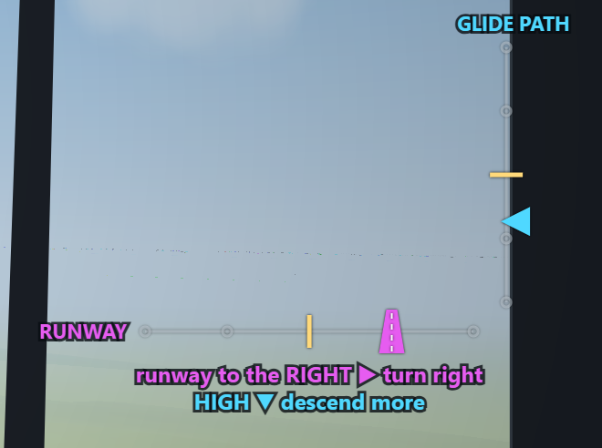 | **ILS** — on the descent and the approach (on a computer on the right, off the view ahead; on a phone high on the windscreen). The yellow marks in the middle are you. On the **RUNWAY** scale the little magenta runway sits where the runway is; on the **GLIDE PATH** scale the cyan triangle sits where the glide path is. Plain words under them say what to do — here "runway to the RIGHT ▶ turn right" and "HIGH ▼ descend more"; when both are right they say "ON THE CENTRELINE AND THE GLIDE PATH". Fly towards the symbols: the runway to the right means turn right, the triangle below means descend more. |
| 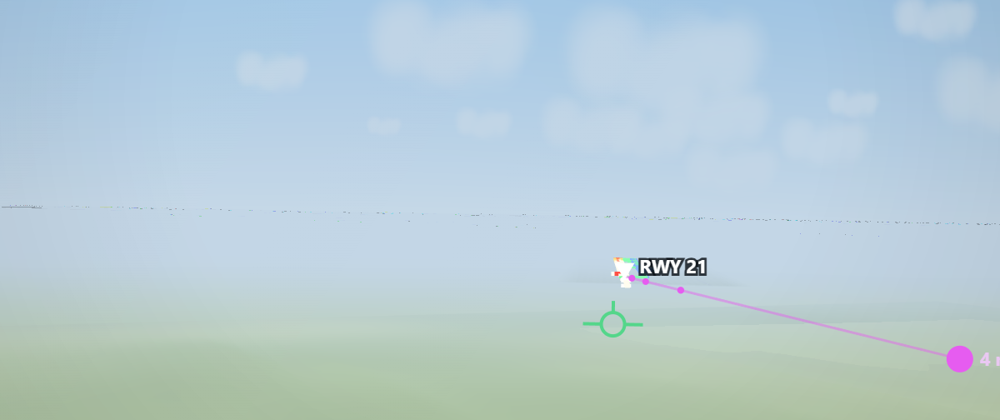 | **Glide path dots and the flight path marker** — in the sky, a **magenta dot** every nautical mile on the extended centreline, at the height of the 3° glide path, down to the runway and its number; fly down the line of dots and you are on the ILS (here the aeroplane is right of the line and high). The **green circle** (cockpit view only) is the flight path marker: where the aeroplane is actually going, with the wind and the descent. Put it on the runway threshold and keep it there, and the aeroplane arrives at the threshold. |

The ILS scales and the glide path dots are the **landing aid**: switch them off on the title screen or in the pause to fly the approach on the instruments alone. Taxi at most 20 kt: twice that is reported as a taxi overspeed and fined (only lifting off counts as a take-off without a clearance). On a passenger flight the crew speaks to the cabin — before the take-off, at the cruise level (height, speed, the air outside), on the descent, before the landing and at the arrival (local time, temperature, ahead of or behind schedule); **Cabin announcements** turns them off.

## Emergencies

Every flight draws its problems: engine fire or failure, a fuel leak, icing, windshear, a bird strike, cabin depressurisation, a gear that will not come down, hydraulic or navigation failure, a medical emergency, a shifted load… When one happens the time acceleration stops, the caution sounds and a **QRH checklist** opens. It says what happened and lists the steps in order; the lit one is next, and each step shows the control that does it. Most are the real controls — thrust to idle with **0**, anti-ice **K**, the gear lever **G**, the speed brake **/**, the autopilot **Y**, pulling up with **↓** — and the checklist ticks them off as you do them; the switches that only exist in the checklist (a fire handle, a crossfeed valve, a call to ATC) are worked with **Enter** (on a phone: tap the lit step or **Go**). Some things can go either way: the fire may need the second bottle, a failed engine may start again. Finish before the timer runs out and you see how long it took; run out of time and the failure escalates — damage, lost engines, lost fuel, a lower pay.

## Difficulty

Chosen on the title screen and in the pause and debrief dialogs, remembered between visits:

- **Easy** — half the wind and light turbulence, one problem at a time, checklists explain why each step is done and give 50 % more time, generous landing grading and no deadlines.
- **Medium** — real wind and turbulence, sometimes two problems in one flight, checklists without the explanations, standard deadlines and grading.
- **Hard** — strong wind and severe turbulence, two problems every flight, 25 % less time on the checklists, short deadlines, strict grading and more damage.

## Career

Money is in Swedish kronor. Each contract pays for the distance and the load, plus bonuses for the landing grade, being on time and handled emergencies, minus the aircraft lease (per flight hour), the fuel burnt, repairs and penalties.

- **Network** — the world is opened a region at a time: **Sweden** (where you start), **Scandinavia & the North Atlantic** (Norway's fjords, Finland, Denmark, Iceland, Greenland, Svalbard), **Europe**, **Russia** (Moscow and St Petersburg, the Urals and Siberia, the Arctic from Murmansk to Khatanga, Vladivostok, Kamchatka and Anadyr), **the Middle East & Africa**, **the Americas** and **Asia & the Pacific** — 132 real airports. Each region's traffic rights need reputation and flights, and cost money. From Arlanda the board offers the open regions; away from home it offers the flight back and onward legs, so the far side of the world is reached in legs of up to 4 500 nm (8 300 km).
- **Long haul** — on the autopilot the time acceleration goes up to ×128, and in the cruise on NAV up to ×256 and ×512, over a world at its real size; Stockholm–New York takes a few minutes of real time. Before the top of descent the time comes back to ×128 by itself, a step every 3 seconds (×512 ends about 155 nm before it in a jet), and on to ×1 near the runway. The fast cruise is calculated ahead rather than step by step, so the autopilot flies it smoothly and the game stays light.
- **Contract board** — six offers at the start, then more as you open regions and fly (up to twenty). Passenger and freight work come in about equal numbers, and every card says how many times you have flown to that airport — or that it is new.

- **Hangar** — eighteen real aircraft, lightest first: the **DHC-6 Twin Otter** bush plane, the 19-seat **Beechcraft 1900D**, the **Fokker F27** freighter, the **ATR 72-600** turboprop, the **Bombardier CRJ200** and **Embraer E195-E2** regional jets, the **Airbus A220-300**, **A320** and **A320neo**, the **Boeing 737-800**, the **Boeing 767-300F** freighter, the **Airbus A330-300**, the **Boeing 787-9 Dreamliner**, the **Airbus A350-900**, the **Boeing 777-300ER**, the giant **Antonov An-124** freighter that lands on gravel and ice, the four-engine **Boeing 747-8F** and the double-deck **Airbus A380**. Every card shows a picture of the aircraft's own 3D model, its key figures (seats, payload, range, cruise) and its real maximum take-off and empty weight (the briefing and the flight strip show the weight of your flight against it), speeds, runway needs and lease. A type that does not suit the airport you are at — its runway too short, a grass strip, or wings too wide for its stands and taxiways — carries a warning on its card, but you may still pick it.
- **Training** — 20 courses in four branches (General, Passenger, Cargo, Bush & SAR). Each ends in a short exam (3 of 4 right) and unlocks aircraft, contract types or real advantages: checklist hints, more time in emergencies, slower icing. The type courses have exams of their own: **Regional Turboprops** (the ATR 72: propellers, feathering, icing; +10 % on short legs), **Fly-by-Wire Jets** (the E195-E2 and the A220: side-sticks and flight computers), **ETOPS & Ocean Crossings** (the A330 and the 787: two engines over the ocean; +10 % on long legs) and **Outsize Cargo** (the An-124: the lifting nose, the kneeling gear, the roof cranes).
- **Filters** over the board and the hangar, remembered between visits: show only passenger, cargo or bush & SAR contracts (the board offers only what your aircraft may fly anyway) and sort them by novelty (the places you have never flown to first), reputation, pay, difficulty or distance; in the hangar pick the kind of aircraft (turboprops, regional jets, narrowbodies, widebodies, freighters), the weight class (up to 30 t, 30–100 t, over 100 t) or only the types you may lease, sorted by weight, range, payload or lease. Press the active sort again to turn it round.
- The **Hangar** tab shows how many types you may fly; a gold dot on **Training** or **Network** means a course or traffic rights are ready for you right now. A type your exam has just unlocked lights the dot on **Hangar** and waits there first in a gold frame; every card shows how many flights you have flown in that type. Each region's card on **Network** shows its map — its airports lit in gold, your base ringed — and the flags of its countries.
- The menus work from the keyboard too: the arrow keys move between the buttons, **Enter** presses one (the focus stays where it was, so you can go on from there), **Esc** goes back. The main action of a screen is the gold button with an arrow (→), the way back the button with ← at the top left.
- **Career** — reputation with three client groups, licences, records and the log. Below −50 000 kr nobody will lease you an aeroplane any more and the career is over.

## Airlines and airports

The clients are real airlines: SAS, Norwegian, Finnair and Widerøe at home, then Lufthansa, British Airways, KLM, Emirates, Qatar Airways, Delta, Qantas, Aeroflot, S7 and about 80 more — passenger airlines, cargo carriers (DHL, FedEx, UPS, Cargolux, West Atlantic) and bush and air ambulance operators. Each has its logo on the contract board, and your aeroplane flies in the colours of the airline that hired it, titles on the fuselage and the emblem on the fin; the home carriers stand at the gates and have their logos on the hangars. An airline only takes the routes it could really fly: domestic flights belong to that country's own airlines (no Aeroflot from Stockholm to Kiruna), a passenger airline flies from or to its own country or one of its bases, each airline works only in its own regions, and there are no flights between Russia and Europe or North America — from Moscow the way home goes through Istanbul or Dubai.

Every airport is recognisable from the cockpit: its name in big letters on the terminal roof, a "Welcome" banner with the city's landmark (the Three Crowns of Stockholm, Big Ben, the Eiffel Tower, the Burj Khalifa, the Sydney Opera House…), the national flag and the city flag on the roof and over the tower — they stream with the wind, like the windsock. Baggage trains come out of the baggage hall in the terminal, drive along the service road between the stands and the building and take the bags out to a departing aeroplane or fetch them from one that has come in — yours too, while it stands at the gate; they give way to your aeroplane and wait until it has passed. Big terminals are signed Terminal 1 and Terminal 2, the others Departures and Arrivals, and the bigger the airport, the more stands behind it: offices, a hotel, a multi-storey car park. The tower grows with the airport too — a little concrete post with a small cab at a tiny field, a slender round tower at a small one, a tall tapering one on a base building with a radar dome at a big hub — and so do the hangars: one small shed with a pitched roof, then arched hangars, and at a big airport a huge maintenance hangar for the wide-bodies. Every airport paints its buildings in its own colours: concrete grey, sand, white and blue, brick, dark steel, cream and green, red Swedish-style sheds or silver with red roofs — and the big famous ones look roughly like the real thing: Pulkovo's golden roof, Denver's white tent roof, Jakarta's terracotta roofs, Gardermoen's oak, KLM-blue hangars at Schiphol, Lufthansa's at Frankfurt, Aeroflot's at Sheremetyevo, Emirates' at Dubai. Runways have concrete ends with joints, tyre marks, shoulders and blast pads, edge and centreline lights, approach lights with a running flasher and a working PAPI (two white, two red: on the glide path); taxiways have shoulders and edge lines, the apron has concrete slabs and stand markings, and a road, a car park and a perimeter road surround the field. Airports grow with their size, from one terminal with a single stand to three terminals of three stands each, and lanes lead off the taxiway into the apron at both ends, between the terminals and between every two stands. A big airport has two or three terminals, each with its number on the building and painted on the road in front; your stands are set with the contract — the departure from the terminal nearest the runway's start, the arrival anywhere — shown on its card and kept when you fly it again. Each big airport signs its terminals in its own typeface and colour. Taxiing, any outside view keeps the pilot's view in a small frame in the corner (where the mini map goes), so you can watch the aeroplane from outside and still see the way ahead; it gives way to the mini map after take-off. **C** also has a camera looking straight down from under the belly. Every flight begins with a short camera flight: a wide shot of your aeroplane at the terminal (or at the runway), then the camera sweeps in over the tail and drops into the captain's seat; parked at the arrival gate, it flies out of the cockpit to the aeroplane at its gate before the debrief. **Enter**, **Space**, **Esc** or a tap skips it.

## Exams

Every course ends in a short exam: four questions, three right to pass. They are written in plain words — a school pupil can work them out — with a **Hint** button and an explanation after every answer, and they run in the game's language — **English, Russian or Swedish**.

## Language

The whole game — the menus, the briefings and debriefs, the prompts and messages in flight, the emergency checklists, the touch buttons, the courses and the exams — is in **English, Russian or Swedish**. The title screen is a sky above a sea of clouds drifting past — golden at dawn and dusk, blue by day, starry at night, following your own clock — with airliners of real airlines flying through it in turn. Pick the language with the flags at the top of the title screen (EN · RU · SV); the choice is remembered (the first time the game takes the language picked in the gallery, else your browser's). Airport, city and airline names and the instrument labels stay as in a real cockpit.

## Units and the map

**Units** on the title screen (and in the pause): aviation units — feet, knots, nautical miles, fpm — or **metric**: metres, km/h, kilometres, m/s, rounded to sensible numbers. Prompts, messages, screens and the instruments all follow the setting.

The **moving map** (**M**) draws the track you have actually flown — yellow on the ground, green in the air — over the planned route. On a big computer screen a **mini map** stays in the top right corner while you fly; **M** switches between the mini map, the big map and no map. The maps show the arrival runway with its final approach (a dashed line and an arrow in the landing direction).

On the approach the **ILS** scales and the **glide path dots** show the way to the runway — see [Instruments](#instruments).

## Graphics

**Auto** (the default) picks Medium on phones and High elsewhere and steps down if the frame rate drops; **Low**, **Medium** and **High** set the terrain detail, draw distance, clouds and trees.

## Tech stack

Plain HTML + CSS + vanilla JavaScript split by concern into folders — `core/` (helpers, language, input, sound), `data/` (airports, countries, airlines, exams, the Russian and Swedish texts, coastlines), `art/` (flags, city symbols, airline emblems), `sim/` (the world, terrain, flight dynamics, systems), `render/` (the 3D models, the hangar pictures, airports and scene) and `ui/` (instruments, cockpit, HUD, screens), with `game.js` and `career.js` on top — no build step. The 3D world uses three.js (vendored as `lib/three.min.js`), the cockpit and instruments are Canvas 2D, and the sound is synthesized with the Web Audio API.
