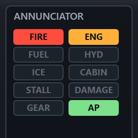

#  World Aviation

*[Read in English](README.md)* · *[Читать на русском](README_RU.md)*

En flygsimulator med vy från cockpit och en pilotkarriär i webbläsaren. Du är en svensk trafikpilot med EASA ATPL och bas på **Stockholm Arlanda**. Du börjar med inrikesflyg i Sverige — Göteborg, Malmö, Visby, Kiruna norr om polcirkeln — vinner sedan Skandinavien och Nordatlanten och, region för region, hela världen: London och Paris, Dubai och Johannesburg, New York och Mexico City, Tokyo och Sydney. Varje flygning går från gate till gate: pushback, motorstart, taxning, start, väder och fel, landning och parkering vid gaten.

**▶ Spela: [gray0072.github.io/ivan/world-aviation/](https://gray0072.github.io/ivan/world-aviation/)**

## Så kör du

Öppna [index.html](index.html) i en webbläsare — inget byggsteg, ingen server behövs. 3D-vyn kräver WebGL (three.js ligger i projektmappen).

## En flygning

1. **Vid gaten** trycker du **Enter** — bogserbilen trycker ut dig på plattan. Starta motorerna (**Enter**) och se N1 och EGT stiga.
2. **Taxning**: **mellanslag** släpper parkeringsbromsen (på mobilen: **Park**); lite gas (**1**–**3**), styr med **← →**, bromsa med **B** och följ den gula pilen till väntepunkten.
3. Vid **väntepunkten** fäller du startklaffar (**F**) och begär startklarering (**Enter**). Linjera upp, full gas (**9**), dra (**↓**) vid Vr, landställ upp (**G**).
4. **Autopiloten** (**Y**): i NAV-läge flyger den rutten, saktar in under nedstigningen (och fäller själv ut luftbromsen när den ligger för högt), svänger in på slutlig inflygning utan att skjuta över centrumlinjen och följer ILS-glidbanan ner till 200 fot (60 m). **T** snabbar upp tiden, **R** saktar ner den: med autopiloten upp till ×128, när du flyger för hand ×2 över 1 000 fot, ×4 över 3 000, ×8 över 6 000, ×16 över 8 000, ×32 över 9 000 och ×64 över 10 000 fot. Nära destinationen saktar tiden ner av sig själv, ett steg var tredje sekund, och är tillbaka på ×1 5 km ut.
5. **Inflygning**: klaffar och landställ ute, landa för hand från 200 fot (60 m) i Vref, bromsa och sakta ner under 35 knop (65 km/h).
6. **Taxa in** efter pilen, stanna i parkeringsrutan vid din gate och dra åt parkeringsbromsen (**Mellanslag**). Motorerna stängs av och genomgången visar betyget och fakturan.

Välj **avgångstid** på genomgången — dag, skymning, natt eller gryning; skymning och gryning betalar 5 % mer, natt 15 %. På natten syns stjärnorna och månen, flygplatsen är sina ljus (inflygningsljus, PAPI, blå och gröna taxibaneljus, upplysta plattor och terminaler), ditt flygplan visar sina navigationsljus, antikollisionsljus och blixtljus, och landningsljusen lyser upp banan framför dig. Nedanför lyser de riktiga städerna orange med vita centrum, vägar binder ihop dem som pärlband och byar strör ljus över landet, så Stockholm, Ruhrområdet eller Tokyo ligger där de ska. Klockan går, så en lång kvällsflygning landar i mörker.

Före en flygning kan du **träna landningen** för en liten avgift (en del av timleasingen): du börjar på finalen vid destinationen, rent — landställ och klaffar uppe — autopiloten håller glidbanan i 10 sekunder och lämnar över 3 nm ut, sedan fäller du ut landställ och klaffar, landar och bromsar under 35 knop. En bra landning ger lite rykte hos kunden (mest för A+, minst för C; bara din bästa träning på varje uppdrag räknas); ett misslyckande kostar inget mer än avgiften. Sedan kan du försöka igen, gå tillbaka till genomgången eller flyga på riktigt.

Att börja **vid gaten** och själv flyga hela markrutinen ger en bonus: +6 % av uppdraget och lite rykte. När du bara vill flyga börjar du **efter pushback** — bogserbilen har redan tagit dig till väntepunkten: ungefär 5 minuter mindre på marken (och mindre leasing på långa flygningar), men ingen bonus. Spelet kommer ihåg hur du helst börjar.

## Kontroller

- **↑ ↓** eller **W S** — tippning (↓ lyfter nosen) · **← →** eller **A D** — roll, och styrning på marken · **Q E** — sidroder
- **Z X** eller **− +** — gas · **1**…**8** — 10 %…80 % · **9** — full gas · **0** — tomgång
- **Enter** — nästa steg på marken: pushback, motorstart, startklarering
- **G** landställ · **F / V** klaffar ut / in · **B** bromsar (håll) · **Mellanslag** parkeringsbroms · **/** spoiler · **K** avisning
- **Y** autopilot · **N** tillbaka till programmet (NAV längs rutten och planerad höjd — efter att du ändrat kurs eller höjd) · **, .** vald höjd · **; '** vald kurs (HDG-läge)
- **T / R** tiden snabbare / långsammare · **C / Shift+C** nästa / föregående vy: cockpit, bakifrån, framifrån bakåt, vinge, fena, landställ, ovanifrån, torn / förbiflygning · **M** karta (på en stor skärm: minikarta, stor karta, ingen karta) · **I** instrumentbelysning · **H** kontrollkort · **Esc** paus

**På mobil eller surfplatta** går spelet till helskärm när du startar (där webbläsaren tillåter det). **Vänstra halvan** av skärmen är en flytande joystick — den dyker upp där tummen landar: dra nedåt för att lyfta nosen, åt sidorna för att rolla och för att styra på marken (noshjulet och rodren är hydrauliska: de följer tummen mjukt, inte på en gång). **Reglaget vid högra kanten** är gasen — dess nedre halva ger fin kontroll över låg dragkraft vid taxning. Färdremsan och tipstexten sitter till vänster; tryck på dem för att fälla ihop eller öppna dem (remsan fälls ihop till rutten, bränslet och tiden kvar). Knapparna sitter i rader som hör ihop: **Menu · View · Map · Ice** (avisning), **AP · NAV** (tillbaka till programmet) **· Time − · Time +**, **Flap − · Flap + · Gear · Spoiler**, **Go** (pushback, start, startklarering) **· Brake · Park** (parkeringsbromsen — släpp den för att taxa). Kartan stängs med ett tryck var som helst på den. En brytare som är på lyser på sin knapp: autopiloten, NAV och utfällt landställ i grönt, spoilern och parkeringsbromsen i rött. Hålls telefonen upprätt går knapparna tvärs över överkanten och de fyra viktigaste instrumenten sitter två och två på en högre panel; på sidan visas stighastigheten som en siffra bredvid höjdmätaren. Båda tummarna fungerar samtidigt, så du kan flyga och arbeta en checklista på en gång.

Kontrollerna fungerar med alla tangentbordslayouter (tangenterna läses efter sin plats, inte efter bokstaven).

**Ljud**: jetmotorerna tjuter och dånar med gasen, propellrarna dunkar, hjulen dunsar över plattfogarna, bromsarna väser, landställ och klaffar surrar och låser med en duns, däcken tjuter vid sättningen — och en röst ropar "V one", "rotate" och höjderna ner till "ten" vid landningen.

## Instrument

Panelen på en datorskärm 4 nm ute på inflygningen till Göteborg, med landstället och klaffarna ute och autopiloten på glidbanan. Från vänster: motorerna, svängindikatorn, fartmätaren, attitydindikatorn (den konstgjorda horisonten), höjdmätaren, variometern, konfigurationsblocket och varningspanelen, med kursbandet ovanför. Instrumentens texter är på engelska, som i en riktig cockpit. Panelen syns i alla kameravyer. På en telefon är de fyra huvudinstrumenten större (hålls den upprätt sitter de två och två), och konfigurationsblocket visar bara klaffarna, landstället, autopiloten och isen (resten lyser på knapparna); hålls telefonen liggande visas stighastigheten som en siffra bredvid höjdmätaren.

| Instrument | Vad det visar och hur det hjälper |
|---|---|
|  | **Fartmätare** (AIRSPEED) — farten genom luften i knop (km/h med metriska enheter), på visaren och i fönstret. **Grön båge**: de normala farterna med klaffarna inne. **Vit båge**: klaffområdet — den börjar vid stallfarten med landningsklaffar, och klaffarna får fällas ut under dess övre ände. **Gul**: nära gränsen, bara i lugn luft. **Rött streck**: får aldrig överskridas (Vne). Markeringarna på kanten: **blå** är Vr, där du drar i spaken under startrullningen; **grön** är Vref, farten på finalen; **magenta** är farten som autopiloten håller. Under inflygningen håller du visaren på den gröna markeringen — fortare och du svävar långt ner på banan, långsammare och du sjunker igenom eller stallar. |
|  | **Attitydindikator** (ATTITUDE) — var nosen och vingarna är mot horisonten: blå himmel, brun mark, den gula flygplanssymbolen fast i mitten. Linjerna ligger 5° tipp isär; skalan upptill visar rollen (10°, 20°, 30°, 45°, 60°) med den gula rollvisaren. I moln, i dimma och i mörker är den det enda sättet att veta vad som är upp: ungefär 10–15° nos upp i stigningen, nästan plant på finalen, 25° roll i en sväng (som autopiloten). **RA** — radiohöjden, hjulens höjd över marken (eller vattnet) rakt under dig. Den visas under 2 500 ft över marken, räknar ner till 0 vid sättningen och blir **gul under 200 ft** på väg ner mot landning, samtidigt som utropet "minimums": härifrån landar du för hand. Ta flaren efter den, inte efter höjdmätaren — börja lyfta nosen mjukt vid ungefär 30 ft. |
|  | **Höjdmätare** (ALT) — höjden över havet, som en riktig barometrisk höjdmätare: den långa visaren visar hundratals fot, den korta tusentals och fönstret siffran (metriskt: ett varv med den långa visaren är 1 000 m). Den **magentafärgade markeringen** på kanten är höjden som är vald för autopiloten (**,** och **.**), på den korta visarens skala — den korta visaren når den när du är framme. Den visar din marschhöjd och hur högt du är över bergen och havet. På banan visar den flygplatsens egen höjd, inte noll: Mexico City ligger 7 300 ft (2 230 m) över havet, så titta på RA vid landningen. |
|  | **Variometer** (V/S) — hur fort du stiger eller sjunker, i tusentals fot per minut (m/s metriskt): noll till höger, stigning ovanför, sjunkning under, upp till 2 000 fot per minut (10 m/s). På en glidbana på 3° är sjunkhastigheten ungefär fem gånger farten över marken: 130 kt → ungefär 650 fot per minut. Titta på den strax före sättningen — mer än 600 fot per minut (3 m/s) är en hård landning, 1 000 (5 m/s) knäcker landstället. |
|  | **Svängindikator** (TURN) — det lilla flygplanet lutar lika mycket som kursen ändras: står det rakt flyger du rakt, ju mer det lutar desto fortare svänger du. Håll det rakt på finalen, så glider du inte sakta av centrumlinjen. |
|  | **Kursband** — kompassen över panelen: den gula triangeln och rutan är din kurs. Den **magentafärgade triangeln** under bandet är bäringen till nästa punkt på rutten (banan under inflygningen) — sväng tills den står under den gula så flyger du rakt mot den. I HDG-läget är ett **blått märke** upptill kursen som autopiloten svänger mot (**;** och **'**). |
|  | **Motorer** — två staplar per motor: **N1** (fläktens varvtal i %, alltså dragkraften; tomgång är ungefär 22 %) och **EGT** (avgastemperaturen). Under starten ser du N1 och EGT stiga; i luften säger stapeln genast **FIRE** (brand), **FAIL** (bortfall) eller **START**, så du vet vilken motor som har problemet. Längst ner: **bränslet** som är kvar, i kg av fulla tankar. |
|  | **Konfiguration** — läget för allt du ställer in, i ord: **THROTTLE** (gasreglaget i %), **FLAPS** (klaffarna, gula i landningslägena, "1>3" medan de rör sig), **GEAR** (landstället, grönt DOWN, gult medan det rör sig), **BRAKES** (bromsarna, PARK — parkeringsbromsen är i), **SPOILER** (rött OUT — luftbromsen är ute), **AP / TIME** (autopilotens läge — NAV längs rutten, HDG på en kurs, G/S på glidbanan — och tidsaccelerationen), **ANTI-ICE** (avisningen), **ICE** (is på vingarna i %), **GS · SEL** (farten över marken och höjden som är vald för autopiloten), **NEXT** och **DIST** (nästa punkt på rutten och hur långt dit). Före landningen räcker en blick: landstället DOWN i grönt, klaffarna ute, luftbromsen inne, parkeringsbromsen ur. |
|  | **Varningspanel** (ANNUNCIATOR) — varningslamporna: **FIRE** (brand) och **STALL** i rött; **ENG** (motor), **FUEL** (bränsle), **HYD** (hydraulik), **CABIN** (kabintryck), **DAMAGE** (skada) och **GEAR** (landstället, även medan det rör sig) i gult; **ICE** (is) i blått och **AP** i grönt medan autopiloten flyger. När varningssignalen ljuder ser du med en blick vad som är fel; samtidigt öppnas QRH-checklistan på skärmen (se Nödsituationer). Här: en motorbrand. |
|  | **ILS** — under nedstigningen och inflygningen (på en dator till höger, utanför vyn framåt; på en telefon högt upp på vindrutan). De gula märkena i mitten är du. På skalan **BANA** (RUNWAY) står den lilla magentafärgade banan där banan ligger; på skalan **GLIDBANA** (GLIDE PATH) står den cyan triangeln där glidbanan ligger. Vanliga ord under dem säger vad du ska göra — här "banan till HÖGER ▶ sväng höger" och "HÖGT ▼ sjunk mer"; när allt stämmer står det "PÅ CENTRUMLINJEN OCH GLIDBANAN". Flyg mot symbolerna: banan till höger betyder sväng höger, triangeln nedanför betyder sjunk mer. |
|  | **Glidbanans prickar och färdvägsmarkören** — på himlen en **magentafärgad prick** för varje nautisk mil på den förlängda centrumlinjen, på glidbanans höjd (3°), ända ner till banan och dess nummer; flyg längs raden av prickar så är du på ILS (här ligger flygplanet till höger om linjen och högt). Den **gröna ringen** (bara från cockpit) är färdvägsmarkören: dit flygplanet faktiskt är på väg, med vinden och sjunkningen. Lägg den på banans tröskel och håll den där, så kommer flygplanet dit. |

ILS-skalorna och glidbanans prickar är **landningshjälpen**: stäng av den på titelskärmen eller i pausen för att flyga inflygningen enbart på instrumenten.

## Nödsituationer

Varje flygning drar sina problem: motorbrand eller motorbortfall, bränsleläcka, isbildning, vindskjuvning, fågelkollision, tryckfall i kabinen, ett landställ som inte går ut, hydraul- eller navigationsfel, en sjuk passagerare, en last som har förskjutits… Då stannar tidsaccelerationen, varningen ljuder och en **QRH-checklista** öppnas. Den säger vad som hänt och listar stegen i ordning; nästa steg lyser, och varje steg visar vilket reglage som gör det. Oftast är det de riktiga reglagen — tomgång med **0**, avisning **K**, landställsspaken **G**, luftbromsen **/**, autopiloten **Y**, dra upp nosen med **↓** — och checklistan bockar av dem när du gör dem; de brytare som bara finns i checklistan (brandhandtaget, crossfeed-ventilen, ett anrop till flygledningen) görs med **Enter** (på mobilen: tryck på steget som lyser eller **Go**). En del kan gå åt båda hållen: branden kan kräva den andra flaskan, en stoppad motor kan starta igen. Hinner du före timern ser du hur lång tid det tog; tar tiden slut förvärras felet — skador, förlorade motorer, förlorat bränsle, lägre betalning.

## Svårighetsgrad

Väljs på startskärmen och i paus- och genomgångsdialogerna, och sparas mellan besöken:

- **Easy** — halva vinden och lätt turbulens, ett problem åt gången, checklistan förklarar varför varje steg görs och ger 50 % mer tid, generös landningsbedömning och inga deadlines.
- **Medium** — riktig vind och turbulens, ibland två problem under en flygning, checklistor utan förklaringar, vanliga deadlines och bedömning.
- **Hard** — stark vind och kraftig turbulens, två problem varje flygning, 25 % mindre tid på checklistorna, korta deadlines, sträng bedömning och mer skador.

## Karriär

Pengarna är svenska kronor. Varje uppdrag betalar för sträckan och lasten, plus bonusar för landningsbetyget, punktlighet och hanterade nödsituationer, minus leasingen av planet (per flygtimme), det förbrukade bränslet, reparationer och avdrag.

- **Nätverk** — världen öppnas en region i taget: **Sverige** (där du börjar), **Skandinavien och Nordatlanten** (Norges fjordar, Finland, Danmark, Island, Grönland, Svalbard), **Europa**, **Mellanöstern och Afrika**, **Amerika** och **Asien och Stilla havet** — 115 riktiga flygplatser. Trafikrättigheterna till varje region kräver anseende och flygningar och kostar pengar. Från Arlanda visar tavlan de öppna regionerna; borta visar den flygningen hem och vidare sträckor, så att andra sidan jorden nås i etapper på upp till 4 500 nm (8 300 km).
- **Långdistans** — med autopiloten går tidsaccelerationen upp till ×128 över en värld i verklig storlek; Stockholm–New York tar ungefär tio minuter i verklig tid.
- **Hangar** — arton riktiga flygplan, från det lättaste till det tyngsta: bushplanet **DHC-6 Twin Otter**, 19-sitsiga **Beechcraft 1900D**, fraktaren **Fokker F27**, turbopropen **ATR 72-600**, regionaljetarna **Bombardier CRJ200** och **Embraer E195-E2**, **Airbus A220-300**, **A320** och **A320neo**, **Boeing 737-800**, fraktaren **Boeing 767-300F**, **Airbus A330-300**, **Boeing 787-9 Dreamliner**, **Airbus A350-900**, **Boeing 777-300ER**, jättefraktaren **Antonov An-124** som landar på grus och is, den fyrmotoriga **Boeing 747-8F** och dubbeldäckaren **Airbus A380**. Varje kort visar en bild av flygplanets egen 3D-modell, de viktigaste siffrorna (platser, last, räckvidd, marschfart) och dess riktiga största startvikt och tomvikt (genomgången och färdremsan visar din flygnings vikt mot den), farter, krav på banan och hyra.
- **Utbildning** — 20 kurser i fyra grenar (Allmänt, Passagerare, Frakt, Bush & SAR). Varje kurs slutar med ett kort prov (3 av 4 rätt) och låser upp flygplan, uppdragstyper eller verkliga fördelar: tips i checklistorna, mer tid vid nödsituationer, långsammare isbildning. Typkurserna har egna prov: **Regionala turbopropplan** (ATR 72: propellrar, flöjling, isbildning; +10 % på korta sträckor), **Fly-by-wire-jetplan** (E195-E2 och A220: sidospakar och flygdatorer), **ETOPS och havsöverfarter** (A330 och 787: två motorer över havet; +10 % på långa sträckor) och **Överdimensionerad frakt** (An-124: den uppfällbara nosen, landstället som knäböjer, takkranarna).
- Fliken **Hangar** visar hur många typer du får flyga; en guldprick på **Utbildning** eller **Nätverk** betyder att en kurs eller trafikrättigheter väntar på dig just nu.
- **Karriär** — anseende hos tre kundgrupper, certifikat, rekord och loggboken. Under −50 000 kr vill ingen längre hyra ut ett flygplan till dig och karriären är slut.

## Flygbolag och flygplatser

Kunderna är riktiga flygbolag: SAS, Norwegian, Finnair och Widerøe hemma, sedan Lufthansa, British Airways, KLM, Emirates, Qatar Airways, Delta, Qantas och ett 75-tal till — passagerarbolag, fraktbolag (DHL, FedEx, UPS, Cargolux, West Atlantic) och bushflyg och ambulansflyg. Varje bolag har sin logga på uppdragstavlan, och ditt flygplan flyger i färgerna hos bolaget som hyrt det, med namnet på flygkroppen och emblemet på fenan. Hemmabolagen står vid gaterna och har sina loggor på hangarerna.

Varje flygplats känns igen från cockpit: namnet med stora bokstäver på terminaltaket, en "Welcome"-banderoll med stadens symbol (Tre kronor i Stockholm, Big Ben, Eiffeltornet, Burj Khalifa, operahuset i Sydney…), landets flagga och stadens flagga på taket och över tornet — de vajar i vinden, liksom vindstruten. Stora terminaler är skyltade Terminal 1 och Terminal 2, de andra Departures och Arrivals, och ju större flygplatsen är, desto fler byggnader bakom den: kontor, ett hotell, ett parkeringshus. Banorna har betongändar med fogar, däckmärken, vägrenar och blast pads, kant- och centrumljus, inflygningsljus med löpande blixtljus och en fungerande PAPI (två vita, två röda: på glidbanan); taxibanorna har vägrenar och kantlinjer, plattan har betongplattor och uppställningsmarkeringar, och runt fältet finns väg, parkering och ringväg.

## Prov

Varje kurs slutar med ett kort prov: fyra frågor, tre rätt för godkänt. De är skrivna med enkla ord — en skolelev kan klura ut dem — med en knapp för **Ledtråd** och en förklaring efter varje svar, och de går på spelets språk — **engelska, ryska eller svenska**.

## Språk

Hela spelet — menyerna, genomgångarna och rapporterna, uppmaningarna och meddelandena under flygningen, nödchecklistorna, pekknapparna, kurserna och proven — finns på **engelska, ryska och svenska**. Välj språk högst upp på startskärmen; valet sparas (första gången följer spelet webbläsarens språk). Namnen på flygplatser, städer och flygbolag, texterna på instrumenten och de talade utropen är kvar som i en riktig cockpit.

## Enheter och kartan

**Units** på startskärmen (och i pausen): flygets enheter — fot, knop, nautiska mil, fot per minut — eller **metriska**: meter, km/h, kilometer, m/s, avrundade till rimliga tal. Uppmaningar, meddelanden, skärmar och instrument följer inställningen.

**Kartan** (**M**) ritar spåret du faktiskt har flugit — gult på marken, grönt i luften — ovanpå den planerade rutten. På en stor datorskärm syns en **minikarta** uppe till höger under flygningen; **M** växlar mellan minikartan, den stora kartan och ingen karta. Kartorna visar landningsbanan vid ankomsten med sin slutliga inflygning (en streckad linje och en pil i landningsriktningen).

Under inflygningen visar **ILS**-skalorna och **glidbanans prickar** vägen till banan — se [Instrument](#instrument).

## Grafik

**Auto** (standard) väljer Medium på mobiler och High i övrigt och sänker nivån om bildfrekvensen faller; **Low**, **Medium** och **High** styr terrängens detaljer, siktavståndet, molnen och träden.

## Teknik

Ren HTML + CSS + vanilla JavaScript uppdelad i mappar efter ansvar: `core/` (hjälpfunktioner, språk, styrning, ljud), `data/` (flygplatser, länder, flygbolag, prov, ryska och svenska texter, kustlinjer), `art/` (flaggor, stadssymboler, flygbolagens emblem), `sim/` (världen, terrängen, flygdynamiken, systemen), `render/` (3D-modellerna, bilderna i hangaren, flygplatserna och scenen) och `ui/` (instrument, cockpit, HUD, skärmar), med `game.js` och `career.js` överst – inget byggsteg. 3D-världen använder three.js (medföljer som `lib/three.min.js`), cockpit och instrument är Canvas 2D och ljudet syntetiseras med Web Audio API.
